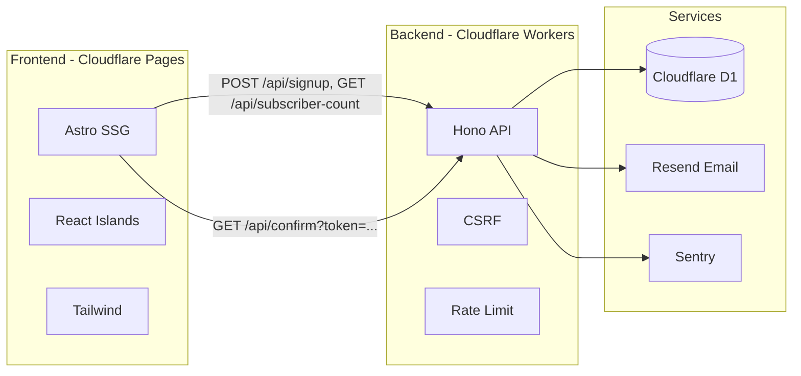

# Astro + Hono Newsletter Stack (SSG + REST API)

## Architecture



- **Frontend**: Astro (SSG), React for interactive components (signup form, subscriber count), Tailwind. Deployed to Cloudflare Pages.
- **Backend**: Hono app on Cloudflare Workers. Same repo; API deployed as a Worker (e.g. `api.example.com` or `example.com/api/*` via routes).
- **Database**: Cloudflare D1 (SQLite), accessed via Drizzle ORM.
- **Email**: Resend for confirmation emails (use Resend REST API via `fetch` in Workers for compatibility).
- **Monitoring**: Sentry for error capture and alerts.

---

## 1. Repo structure

Use a **monorepo** so frontend and API share env and docs:

- `apps/website` — Astro app (SSG)
- `apps/api` — Hono app (Cloudflare Worker)
- `packages/db` (optional) — shared Drizzle schema and migrations; or keep schema inside `apps/api/src/db`

Recommended minimal layout:

- `apps/website/` — Astro, React, Tailwind, `astro.config.mjs`, `package.json`
- `apps/api/` — Hono, Drizzle, `wrangler.toml`, `src/index.ts`, `src/db/`, `src/routes/`, `migrations/`
- Root `package.json` with workspaces (e.g. `pnpm workspaces`) and scripts to run/build both apps

---

## 2. Cloudflare Worker

The API runs as a **Cloudflare Worker**: a serverless fetch handler that executes at the edge. Hono is the framework; the Worker is the runtime.

**Worker entry point** (`apps/api/src/index.ts`):

- Create the Hono app with the Cloudflare Workers adapter: `import { Hono } from 'hono'` and type the app with your bindings (see below).
- Export the Worker fetch handler so Cloudflare can invoke it:
  - `export default app` (when using `wrangler` with a default export that has a `fetch` method), or
  - `export default { fetch: app.fetch }` so the Worker's `fetch` is the Hono app's `fetch`.
- All API routes (signup, confirm, subscriber-count) are handled by this single Worker.

`**wrangler.toml**` (in `apps/api/`):

- `**name**` — Worker name (e.g. `newsletter-api`).
- `**main**` — Entry file (e.g. `src/index.ts`).
- `**compatibility_date**` — Set to a recent date for stable runtime behavior.
- **Bindings**:
  - **D1**: `[[d1_databases]]` with `binding = "DB"` (see Database section).
  - **Vars**: `[vars]` for non-secret config (e.g. `FRONTEND_URL`, `SENTRY_DSN`).
  - **Secrets**: `RESEND_API_KEY` (and optionally `SENTRY_DSN`) via `wrangler secret put`.
  - **Rate limiting** (optional): If using Workers Rate Limiting, add the rate limit binding (namespace, limit, period).

**Bindings type** (for TypeScript): Run `wrangler types` (or `wrangler types src/worker.d.ts`) to generate `env.d.ts` so `Env` includes `DB`, `RESEND_API_KEY`, `FRONTEND_URL`, etc. Pass `Env` to `Hono<{ Bindings: Env }>` so route handlers get typed `c.env.DB` and `c.env.RESEND_API_KEY`.

**Local dev**: `wrangler dev` in `apps/api` runs the Worker locally; use `wrangler dev --remote` to hit a real D1 instance. Point the Astro app's `PUBLIC_API_URL` at `http://localhost:8787` (or the port Wrangler prints) for local testing.

---

## 3. Database (Cloudflare D1 + Drizzle)

**D1 binding** in `apps/api/wrangler.toml`:

```toml
[[d1_databases]]
binding = "DB"
database_name = "newsletter-db"
database_id = "<create via wrangler d1 create>"
```

**Schema** (e.g. `apps/api/src/db/schema.ts`):

`**subscribers**` table:

| Column               | Type      | Notes                                       |
| -------------------- | --------- | ------------------------------------------- |
| `id`                 | integer   | Primary key (auto-increment)                |
| `email`              | text      | Unique, normalized (plus-address cleaned)   |
| `created_at`         | timestamp | Set on insert                               |
| `updated_at`         | timestamp | Set on insert and update                    |
| `traffic_source`     | text      | Optional (e.g. from `?traffic=linkedin`)    |
| `device`             | text      | One of: `'mobile'`, `'desktop'`, `'tablet'` |
| `email_verified`     | timestamp | When user confirmed; null until confirmed   |
| `unsubscribed`       | timestamp | When user unsubscribed; null if active      |
| `confirmation_token` | text      | Unique token for confirm link               |

- Normalize email before insert: strip plus-addressing (e.g. `nickolsoncodes+12345@gmail.com` → `nickolsoncodes@gmail.com`) and lowercase for storage and uniqueness.

**Drizzle**:

- `drizzle.config.ts`: dialect `sqlite`, schema path, `out: './migrations'`.
- Use `drizzle-orm` with `@libsql/drizzle-d1` or the Drizzle D1 adapter for Cloudflare.
- Commands: `pnpm drizzle-kit generate`, apply with `wrangler d1 migrations apply newsletter-db`.

---

## 4. Backend API (Hono)

**Entry** (`apps/api/src/index.ts`): Create Hono app, attach Cloudflare bindings (D1, env for Resend, Sentry), apply global middleware, mount routes.

**Middleware order** (recommended):

1. **CORS** — Allow frontend origin (e.g. `https://yoursite.pages.dev` and production domain).
2. **CSRF** — Use a Hono CSRF middleware (e.g. same-origin + custom header or double-submit cookie). For JSON APIs, common pattern: require a header like `X-CSRF-Token` or `X-Requested-With: XMLHttpRequest` and validate origin/referer; or issue a token from a safe GET and require it on POST.
3. **Rate limiting** — Use `@hono-rate-limiter/cloudflare` with Workers Rate Limiting binding, or a KV/store-based limiter. Apply to `/api/signup` (stricter) and optionally to `/api/subscriber-count` and `/api/confirm`. Key by IP (or CF-Connecting-IP). Return 429 when exceeded.

**Routes**:

| Method | Path                    | Behavior                                                                                                                                                                                                                                                                                                                                                                                                                                                                                                                                                                                   |
| ------ | ----------------------- | ------------------------------------------------------------------------------------------------------------------------------------------------------------------------------------------------------------------------------------------------------------------------------------------------------------------------------------------------------------------------------------------------------------------------------------------------------------------------------------------------------------------------------------------------------------------------------------------ |
| GET    | `/api/subscriber-count` | Count rows where `email_verified IS NOT NULL` and `unsubscribed IS NULL`. Return JSON `{ count: number }`. Handle DB errors; return 500 and report to Sentry.                                                                                                                                                                                                                                                                                                                                                                                                                              |
| POST   | `/api/signup`           | Body: `{ email: string }`. Optional query: `?traffic=linkedin`. Validate with Zod (email format). Normalize email (plus-addressing, lowercase). Derive `device` from request `User-Agent` (mobile / desktop / tablet). Check unique; if already verified (`email_verified` set), return 200 with generic success. Else create or update row: set `confirmation_token` (secure random), `traffic_source`, `device`, `created_at`, `updated_at`. Send confirmation email via Resend (link: `GET /api/confirm?token=...`). Return 201 or 200. On failure, capture with Sentry and return 500. |
| GET    | `/api/confirm`          | Query: `token`. Look up subscriber by `confirmation_token`. If not found or already verified (`email_verified` set), redirect to a "link invalid or already used" page or home. Else set `email_verified = now()`, update `updated_at`. Redirect (302) to frontend thank-you page (e.g. `https://yoursite.com/thank-you`).                                                                                                                                                                                                                                                                 |

**Plus-addressing**: Parse email; if it contains `+` and a domain that supports it (e.g. Gmail), reduce to `local@domain`. Store only the normalized form; use it for uniqueness and in Resend "to" if you want (sending to the original address is also fine).

**Resend**: In Workers, call Resend's REST API with `fetch` and `RESEND_API_KEY` from env. Email content: link `https://<api-or-frontend>/api/confirm?token=<token>` (must point to the Worker so it can update D1 and redirect).

**Sentry**: Initialize Sentry for Cloudflare Workers (e.g. `@sentry/cloudflare`). Capture exceptions in route handlers and in middleware; set DSN via env. Configure alerts in Sentry dashboard.

**Env / secrets**: `RESEND_API_KEY`, `SENTRY_DSN`, frontend base URL for redirect. In `wrangler.toml` use `[vars]` for non-secret and `wrangler secret put` for secrets.

---

## 5. Frontend (Astro + React)

**Setup**: Create Astro project in `apps/website` with React integration (`@astrojs/react`), Tailwind (`@astrojs/tailwind` or Tailwind v4), and `output: 'static'` for SSG.

**Config**: `PUBLIC_API_URL` (or `API_URL`) for the Hono base URL (e.g. `https://api.yoursite.com`). Use in client-side fetch only (no secrets).

**Signup form** (React island, e.g. `SignupForm.tsx`):

- Input: email. Validate in browser (regex or a small validation lib; ensure format and basic sanity).
- On submit: disable button and show loading state (prevent double submit). POST to `POST /api/signup` with `{ email }`. Append `?traffic=...` from `window.location.search` (e.g. `traffic=linkedin`) to the request URL or send as query param.
- On success: show success message. On error (4xx/5xx): show error message. Re-enable button and clear loading on finish.

**Thank-you page**: Static route `/thank-you` (e.g. `src/pages/thank-you.astro`). Content: "Thanks for confirming your email."

**Confirmation flow**: User clicks link in email → `GET /api/confirm?token=...` (Worker) → Worker updates D1 and redirects to `https://yoursite.com/thank-you`.

**Subscriber count** (React component): On mount, `GET /api/subscriber-count`. Show loading state, then count or error state (retry or message). Prefer a single count display (e.g. "Join 1,234 subscribers").

**SEO**:

- Per-page meta tags: title, description, OG and Twitter tags (e.g. `og:image`, `og:title`, `og:description`, `twitter:card`). Use Astro's `Astro.props` or a layout with props.
- Sitemap: `@astrojs/sitemap` with `site` in `astro.config.mjs`; generates `sitemap-index.xml`/`sitemap-0.xml`.
- `robots.txt`: Static file in `public/` or generate in build (e.g. `User-agent: *`, `Allow: /`, `Sitemap: https://yoursite.com/sitemap-index.xml`).

**Layout**: Single responsive layout (Tailwind); mobile-first, breakpoints for desktop. Use semantic HTML and one main content area.

**404**: `src/pages/404.astro` (or `src/pages/[...slug].astro` that returns 404 for unknown paths). Link back to home.

**Footer**: Copyright (year + name), links to Terms of Service (`/terms`), Privacy Policy (`/privacy`), and Contact (e.g. `mailto:` or `/contact`). Static pages: `terms.astro`, `privacy.astro`, `contact.astro` with placeholder content; Tailwind for typography.

---

## 6. Deployment

- **Frontend**: Connect repo to Cloudflare Pages; build command and output directory for `apps/website` (e.g. `pnpm build`, `dist`). Set `PUBLIC_API_URL` in Pages env.
- **API**: Deploy Worker from `apps/api` (`wrangler deploy`). Configure custom domain (e.g. `api.yoursite.com`) or a route under main domain.
- **D1**: Create DB with `wrangler d1 create newsletter-db`; run migrations in CI or manually before deploy.

---

## 7. Security and robustness

- **CSRF**: Enforced by middleware on the Worker; frontend sends required header or cookie as chosen.
- **Rate limiting**: Applied on signup and optionally on confirm and subscriber-count to protect DB and Resend.
- **Validation**: Zod on signup (email); reject invalid or disposable domains if you add rules later.
- **Sentry**: All uncaught errors and explicit capture in API; frontend optional.

---

## 8. File checklist (high level)

| Area     | Key files                                                                                                                                                                                                             |
| -------- | --------------------------------------------------------------------------------------------------------------------------------------------------------------------------------------------------------------------- |
| API      | `apps/api/src/index.ts`, `apps/api/src/db/schema.ts`, `apps/api/src/routes/signup.ts`, `confirm.ts`, `subscriber-count.ts`, `apps/api/wrangler.toml`, `apps/api/drizzle.config.ts`                                    |
| Frontend | `apps/website/src/pages/index.astro`, `thank-you.astro`, `terms.astro`, `privacy.astro`, `contact.astro`, `404.astro`, `apps/website/src/components/SignupForm.tsx`, `SubscriberCount.tsx`, layout with meta + footer |
| SEO      | `apps/website/astro.config.mjs` (site, sitemap), `apps/website/public/robots.txt`, layout meta tags                                                                                                                   |

This plan gives you a single implementation path for frontend (Astro + React SSG), backend (Hono + D1 + Drizzle), signup with validation and plus-address cleaning, confirmation flow with Resend, subscriber count with loading/error states, CSRF and rate limiting, Sentry, and SEO/404/footer pages.
